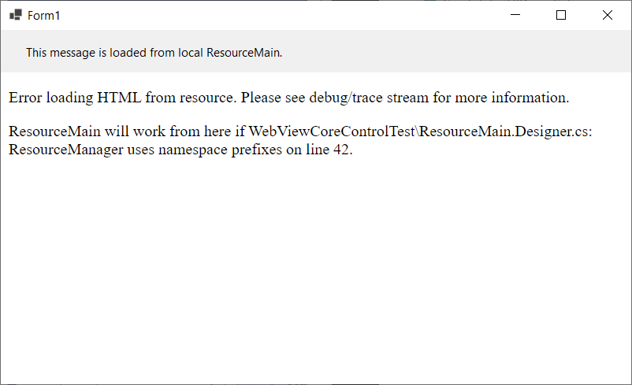
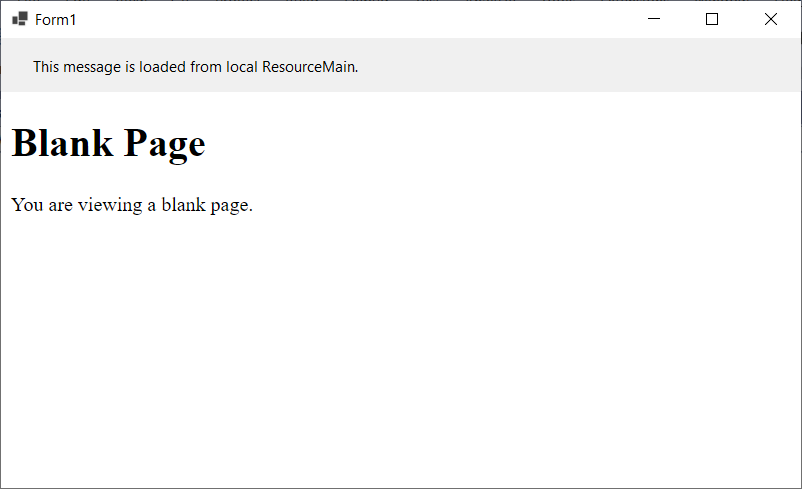

# ResXFileCodeGeneratorIssues8Code
Diagnostic code to accompany Issue Number 8 on ResXFileCodeGenerator.

This repository contains a specific diagnostic project designed to cause an error for diagnosis in the repair of ResXFileCodeGenerator. Any files that have been taken from otherwise working projects have been paired down to only what is needed to illustrate the issue and reproduce the problem.

No part of this project should be used for production.  

## PREREQUISITES
This is a Windows-specific project that makes use of **Microsoft WebView2**. Prior to running the project, please make sure you have already installed the [Microsoft WebView2 Runtime](https://developer.microsoft.com/en-us/microsoft-edge/webview2/) on your PC.  

## Reproducing The Problem
To reproduce the problem with this project, download the repository, open Source / WebView2CoreTest.sln in Visual Studio 2022, and run the project.

You will see the following form.

 - Stop the application and open code view on WebViewCoreControlTest / ResourceMain.Designer.cs at line 42.
 - Change the portion of the line that reads <code>System.Resources.ResourceManager("<b>ResourceMain</b>", typeof(<b>ResourceMain</b>).Assembly)</code> to read <code>System.Resources.ResourceManager("<b>WebViewCoreControlTest.ResourceMain</b>", typeof(<b>WebViewCoreControlTest.ResourceMain</b>).Assembly)</code>

After working-around the issue, notice that the control will properly display information from the local resx file.

